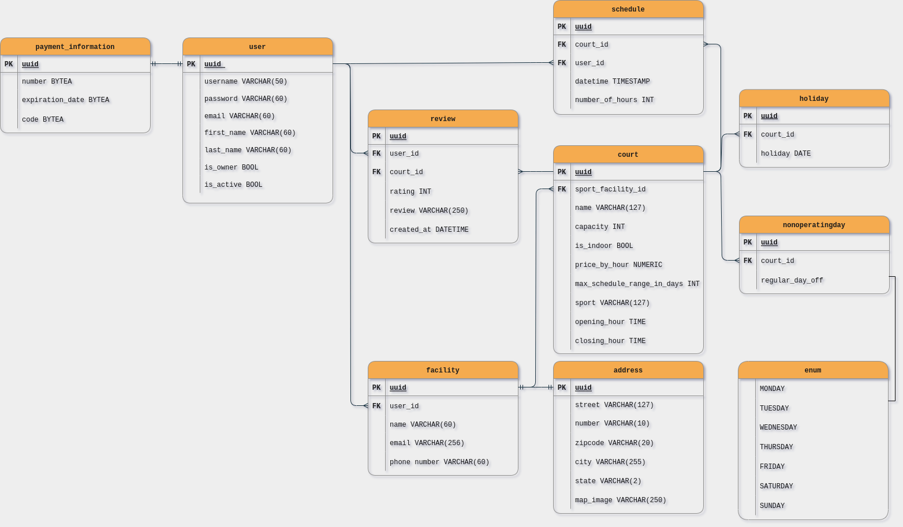

## :calendar: Court Scheduler

This is a backend applicaton with a RESTful API of an sport-facility/court scheduler. It allows an user  to register their sport facility and add sport courts to it. 
General users can then look for the courts and schedule time slots according to the availability. 

> Link for deployed [API](https://court-scheduler.herokuapp.com/api/) \
> Check the [documentation](https://court-scheduler.herokuapp.com/api/doc/) for proper use

## :toolbox: Tools required

- Docker :whale2:;
- You might also consider using [Postman](https://www.postman.com/downloads/) or [Insomnia](https://insomnia.rest/download) to send API requests.

## 📋 Instalation guide

- Clone this repo;
- On the root folder execute `docker compose up`;
- Once the container is up and running, the configured port is 8000, check it running on `http://localhost:8000/api/doc/`
- Send requests `to http://localhost:8000/api/***` based on the [docs](https://court-scheduler.herokuapp.com/api/doc/).

## 💭 features

:heavy_check_mark: Email for activating new accounts;\
:heavy_check_mark: Email confirmation with static map location when scheduling a time slot in a court;\
:heavy_check_mark: Email confimation for cancelations;\
:heavy_check_mark: Add holidays, regular days off to courts.

## 💻 Tech stack

     
  
## ER Diagram

## :telescope: Upcoming updates

- [ ] Build a frontend for the application;

## :memo: License

[MIT](./LICENSE)

